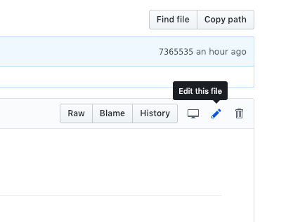
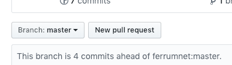

# Contribution Guideline and Tutorial

Follow these steps to contribute to this repository:

1. Fork the repository by clicking on the ***Fork** button on the top right corner.
2. Open the markdown file you are planning to update, e.g. `README.md` by clicking on the name
3. Click on the "Edit this file" button


4. Update your changes and use the following template in the commit:

```
Commit Purpose: <e.g. Fixing grammar>

Commit Justification: <e.g. The phrase 'that' is used inappropriately>

```


5. Save and go back to the main repository (e.g. your_name/techpaper)
6. Create a "Pull Request" by clicking on the "Pull Request" button.

7. Submit the pull request and engage in the discussion with the repository managers.


Thank you for your contribution!

Happy Contributing
