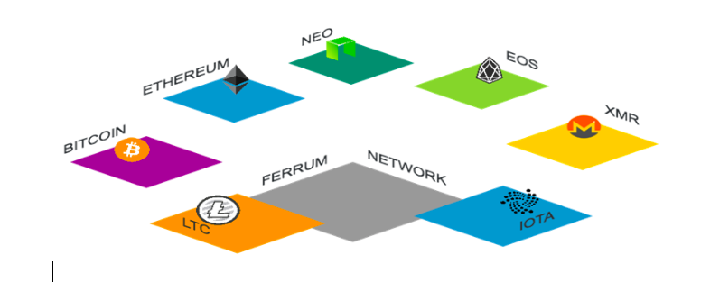
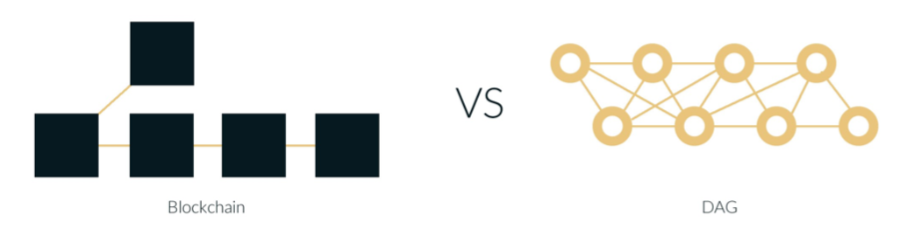
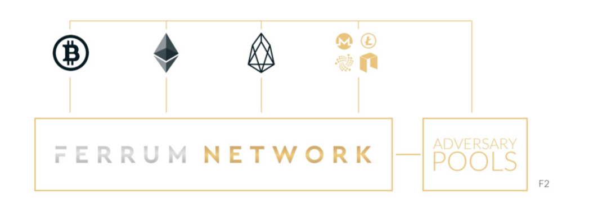
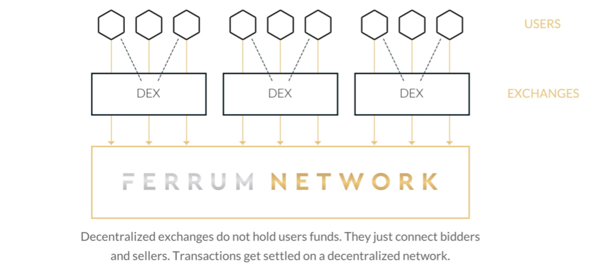
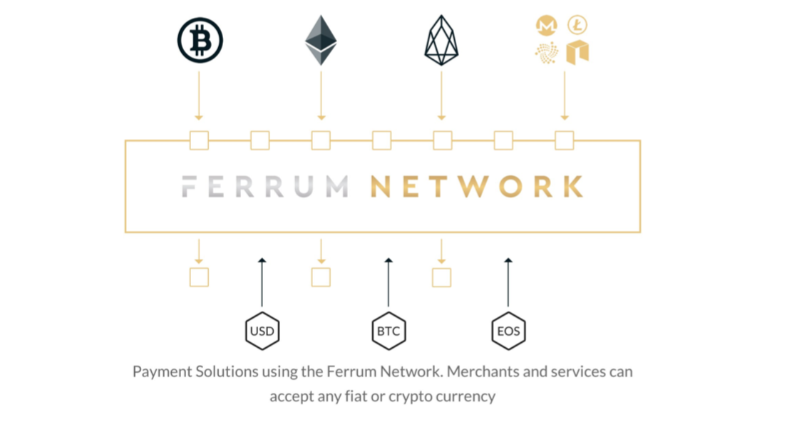
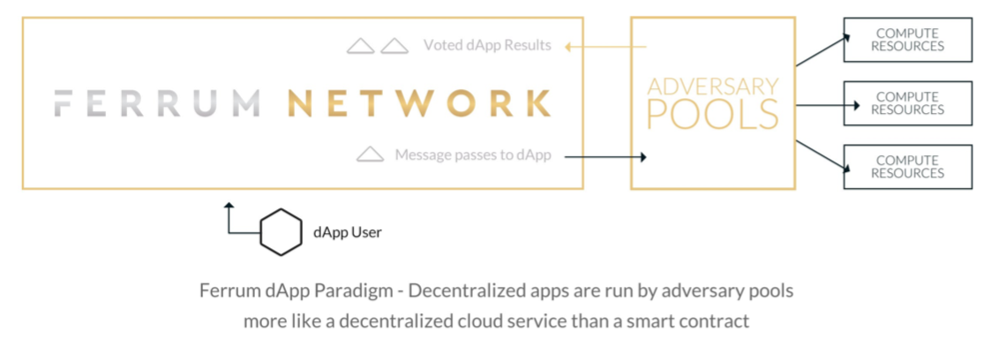
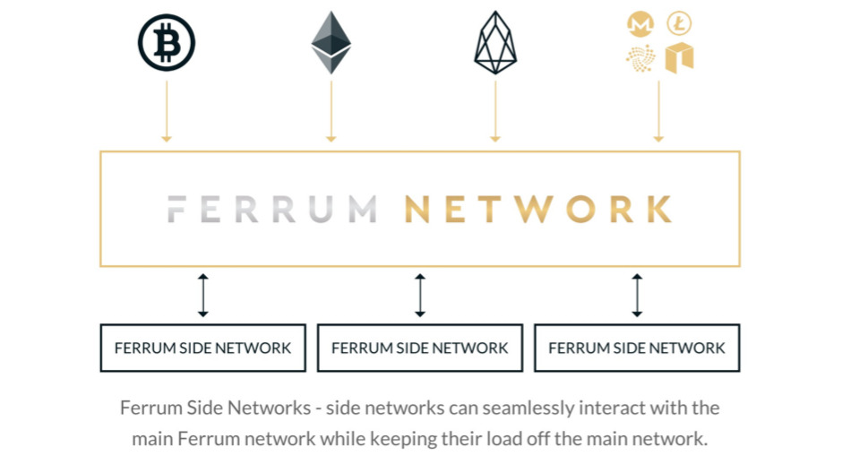
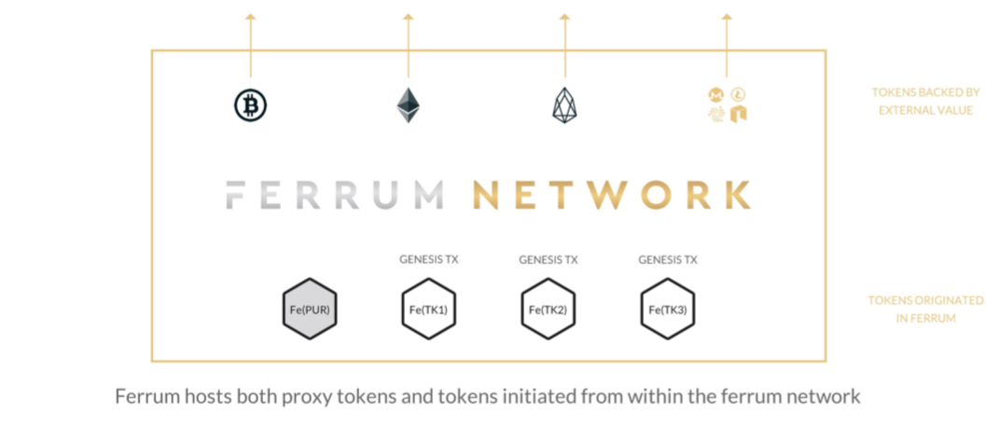
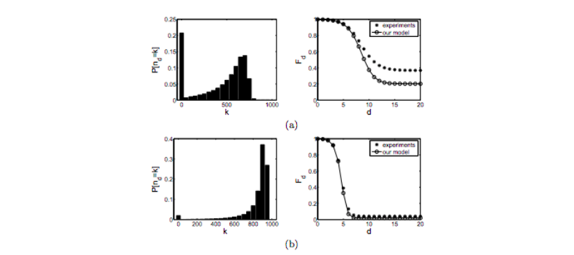

# Ferrum Network Technical Paper

## Abstract

Ferrum Network is a decentralized interoperability network enabling the management, transaction and exchange of any digital asset, without taking custody of user’s assets. Built on a directed-acyclic graph (DAG), Ferrum is faster, less costly and more scalable than traditional blockchains. Ferrum is blockchain agnostic, meaning it can support assets from any network, and is not limited to ERC-20 tokens. Ferrum has built an interoperable decentralized wallet and decentralized exchange on top of the network, with more dApps in development. Users can deposit their digital assets into Ferrum, generating a proxy token of identical value that can be transacted peer-to-peer using the Ferrum Wallet, or exchanged over our user-friendly decentralized exchange. The Ferrum DEX supports advanced features like high frequency trading, short selling and AI driven trading assistance. In addition, Ferrum Network is building fiat gateways, starting with West Africa’s Kudi Exchange, for the fast and inexpensive exchange of fiat currencies and cryptocurrencies. Ferrum Network runs on its native Ferrum Token, the gas of the network. Nominal amounts of the token are spent and burned to execute transactions, import and export value to and from the Network, and to prevent malicious actors from spamming the Network. After engaging in countless fast and inexpensive transactions, users can securely withdraw their tokens back to their original blockchains. Ferrum Network and its line of decentralized products are designed with a singular goal in mind: to empower people with decentralized financial applications.

## Introduction and Problem Statement

We live in a multi-token world, with thousands of digital assets residing across hundreds of separate blockchains. Bitcoin, Ethereum, Ripple, IOTA and EOS are all examples of major digital currencies that exist across separate networks, each with their own unique use cases. The ecosystem benefits from a wide variety of networks, tokens, and projects aiming to solve the challenges posed by building an opened and fairer world. However, a fundamental challenge remains – how to enable communication, transaction and exchange across hundreds of separate and distinct networks? In other words, how can we enable the myriad blockchains to interoperate.

The challenge posed by interoperability goes beyond academic theory – it is a fundamental issue that pervades the entire crypto ecosystem and directly impacts all crypto users. It is a primary reason why we have not meaningfully achieved Satoshi Nakamoto’s vision of a “purely peer-to-peer version of electronic cash that allow online payments to be sent directly from one party to another without going through a financial institution”.  It is why the vast majorities of currencies are exchanged through traditional, trust-based centralized exchanges, which custody users’ assets and introduce risk, friction and cost.

The current solutions to the challenge of interoperability, such as atomic swaps and decentralized ERC-20 networks  are laudable, yet greatly limited in terms of speed, scalability and functionality. To date, a decentralized network enabling the fast, inexpensive and functional exchange of any digital asset across any blockchain has not been successfully implemented. Instead, powerful centralized exchanges have been erected, wielding outsized influence over the ecosystem, introducing third-party risk, and undermining Nakomoto’s original vision. At the same time, many existing offerings of decentralized exchanges are not satisfactory due to a combination of limited token offerings, poor user experience, and slow transaction times.

Figure 1 - Ferrum Network’s Interoperability Diagram

Enter Ferrum Network, enabling the fast and inexpensive peer-to-peer exchange of any digital asset, regardless of originating blockchain. Ferrum is a decentralized platform where users can manage, transact and exchange their digital assets without passing the custody of their assets to a third-party. Built on a directed-acyclic graph (DAG) network , Ferrum has inherent advantages over traditional blockchains in terms of speed, cost and scalability . By utilizing Ferrum’s groundbreaking technology to securely import and export value across chains, users can deposit any asset into Ferrum Network creating a proxy token that can be transacted and exchanged using the Ferrum Wallet or the Ferrum DEX.

The Ferrum Wallet has unique features for sending and receiving transactions that allow users to engage in risk-free and near-instant peer-to-peer exchanges of the following digital assets, with many more being integrated: Bitcoin, Ethereum, Ripple, True USD, Gemini Dollar, NEO, and the Ferrum Token, FRM. Because both parties must authorize a transaction before it is executed, the Ferrum Wallet also enables risk-free, near instant over-the counter (OTC) trading at a fraction of the usual cost.

In addition, users can trade their assets over Ferrum’s user-friendly yet sophisticated decentralized exchange, the Ferrum DEX. The Ferrum DEX has advanced features such as decentralized risk-free high frequency trading, margin smart contracts for short selling assets, and an AI trading assistant; features that exist nowhere else in the DEX space. Users can engage in countless fast and inexpensive transactions over the Ferrum Network, and at any time they can securely withdraw their assets back to their original blockchains.

Ferrum runs on its native utility token, the Ferrum Token. Spending the Ferrum Token is necessary to prevent malicious actors from spamming the network. It is also used to execute transactions, import/export value, increase transaction speeds, and enable use of the Ferrum Sub Zero Wallet – the simplest and most secure way for users to store their digital assets. Spending Ferrum Token burns the token, so the system inherently limits the supply.

Ferrum is also building a decentralized line of fiat gateway applications that will enable the exchange of cryptocurrencies and digital fiat currencies, including a fiat gateway integration using Ripple XRP, and through Ferrum’s forthcoming West African fiat gateway, the Kudi.Exchange.
Ferrum provides the decentralized ecosystem for most major financial applications. To further our vision of cryptocurrencies being used for day-to-day needs, we realized we could not ignore the problem of storing private keys for the wallet. Therefore, we proposed and built the Ferrum Sub Zero wallet. The Ferrum Sub Zero wallet is arguably the most secure, mobile and most accessible cold wallet in the world. Welcome to Ferrum Network– empowering people with decentralized financial applications.

## The Background and Introduction to Ferrum Network

When Satoshi Nakamoto developed the Bitcoin network in 2008, no one could have predicted the proliferation of thousands of other digital assets, each with their own special use case, value proposition and network. We view the pace of innovation and proliferation of utility tokens as a net positive, but one that poses unique challenges. Blockchain technology, the distributed, consensus-based ledger underpinning most decentralized networks, does not readily lend itself to cross-chain communication. In practical terms this means that a holder of bitcoin cannot conduct a peer-to-peer exchange with a counterparty that holds only Ethereum. The existing solutions to this seemingly simple problem have proven costly, risky, ineffective and slow, or involve moving the transactions completely off-chain .

The simplest (and most costly) means of exchanging digital assets that reside on separate blockchains is through a centralized exchange. However, since these institutions hold user’s assets, they are the antithesis of Nakamoto’s vision of “a purely peer-to-peer version of electronic cash allow online payments… without going through a financial institution”. Moreover, the security flaws inherent in centralized custody solutions has been repeatedly demonstrated, from the Mt. Gox hack in 2014  to the Coincheck hack in 2018 , and many in between. And the absence of privacy imposed by centralized exchanges is contrary to the open and free financial system that the crypto ecosystem is striving for. While their ease-of-use, advanced trading features, and ability to act as a fiat onramp suggests that centralized exchanges will continue to play a key role in the ecosystem, their value is limited due to custodial risks, lack of privacy and exorbitant fees. The world of cryptocurrencies deserves a decentralized alternative to the present situation.

Recognizing the limitations of centralized exchanges, numerous decentralized or semi-decentralized exchanges (DEXs) have arisen, which purportedly enable the peer-to-peer exchange of digital assets. However, none of the existing DEX solutions satisfy the needs of the market. First, the vast majority of DEXs are not interoperable; meaning they are limited to ERC-20 tokens only. Traders of top digital assets including Bitcoin, Litecoin, EOS, IOTA, NEO Stellar, Ripple, etc. are effectively excluded. Second, many DEXs leave users wanting in terms of user experience, functionality, and transaction speeds. Alternative technologies that attempt to solve the problem of interoperability, such as atomic swaps, are inherently slow and have not been meaningfully implemented.

Ferrum Network has solved these problems by building a blockchain agnostic network from the ground up. Utilizing breakthrough cryptography techniques for secret sharing without a trusted dealer, and innovative techniques based on quorums, Ferrum enables the fast and inexpensive exchange of nearly any token, regardless of the originating blockchain. Because all transactions occur within Ferrum’s directed acyclic graph (DAG) network, which is designed with this specific use case in mind, transactions are faster and less expensive than alternative decentralized networks that require communication and relays between separate blockchains.

This is how Ferrum Network works: users create their private Fe Wallet that only they control via private key. With the click of a button, users can securely import their assets into the Ferrum Network, creating a proxy of said assets, which are safely held in their Fe Wallet. Want to exchange Bitcoin directly for Ethereum? The Fe Wallet allows users to easily trade their tokens over-the-counter (OTC) with no counterparty risk. Since each party must accept the transaction before it is executed, Ferrum users can conduct risk-free decentralized OTC trades at a fraction of the time and cost of a typical OTC trade, all using the intuitive and user-friendly Fe Wallet. Moreover, Ferrum’s unique system of accepting transactions eliminates the risk of users sending their tokens to the wrong address.

Like Coinbase and Coinbase Pro, the Fe Wallet is connected to Ferrum’s decentralized exchange, the Fe DEX. The Fe DEX and accompanying order book seamlessly and anonymously connects makers and takers, enabling the peer-to-peer exchange of almost any digital asset via simple-to-execute market orders and/or limit orders, with near-zero fees.  This means users can exchange almost any digital asset without having to trust an intermediate third party, and the transaction can be completed in less than second, and at a fraction of the cost of a centralized exchange transaction. In addition, the Fe DEX will offer such advanced trading features as high frequency trading, short selling, and AI driven trading assistance - offerings completely unique to the DEX space. Ferrum is also developing methods for a fiat gateway integration into the Ferrum Wallet.

Ferrum Network and its line of decentralized products run on its native utility token, the Ferrum Token, or “FRM”. As the gas of the network, users spend small amounts of Ferrum Tokens to execute functions across the network, which prevents malicious actors from spamming the network. FRM can also be spent to reduce fees and increase transaction speeds. Because Ferrum Tokens are burned whenever they are spent, the system inherently limits supply of FRM tokens.

In sum, Ferrum Network and its decentralized suite of products offer the features, functionality, and breadth of offerings of a centralized network, but without the custodial risk, privacy concerns, and exorbitant costs associated with the centralized alternative.

## The Problems with Centralized Exchanges

Blockchain and cryptocurrencies were supposed to provide a trustless decentralized means for peer-to peer transactions. However, in reality, a vast majority of cryptocurrencies are held and transacted through a few large institutions and centralized exchanges . The current situation is far from the promised world of decentralized transactions and community owned currencies, and is more akin to the traditional, but less effective banking system, with accompanying scalability issues and expensive transaction fees. There is clearly a need for a decentralized exchange where one can contribute to the system with no need to trust or rely on centralized entities. In our view, this is one of the biggest failures of cryptocurrencies, and the need to address this problem is keenly felt by the community.

The problems with centralized exchanges have been well documented. First and foremost is the issue of trust. Users entrust their private keys to centralized entities, such that if the exchange is hacked or goes down, users' funds are at risk. This risk is amplified in the centralized context because there is a single point of failure, and the “honey pot” scenario, i.e. the substantial funds held by centralized exchanges, attracts hackers. Second, because they are for-profit entities, centralized exchanges often charge high transactions fees. Third, centralized exchanges effectively act as walled gardens, greatly limiting the number of projects who wish to list their digital asset on the exchange, and exacting exorbitant costs for the right to list a token. For instance, according to a Business Insider investigation, as of March 2018, centralized exchanges were charging $50,000 to $1,000,000 to list a token . The result is that early adopters of nascent cryptocurrency projects effectively have no means of exchanging their tokens. Finally, centralized exchanges require that users sacrifice their privacy to simply enter into a financial transaction. It seems we have returned to a system where centralized gatekeepers wield most of the power, increasing risks and costs, while at the same time harming innovation and privacy. In short, old-fashioned centralized exchanges, which are trust-based businesses, facilitate the exchange of cryptocurrencies based on traditional centralized and fee-based business structures.

Currently, there is a lack of organic solutions for communities to support their decentralized technologies. Instead, they need to rely on centralized exchanges to adopt their technologies before users can buy into their platform, or look to a decentralized alternative, all of which have significant shortcomings.

## The Problems with Many Existing Decentralized Exchanges

2018 has often been hailed as the "year of the DEX". And while many decentralized exchanges are now operational, and we salute their trailblazing efforts, none have credibly solved the fundamental problem of interoperability. For instance, most of the existing solutions run on top of the Ethereum network, meaning they use smart contracts and payment channels to facilitate exchange, however they only support ERC-20 tokens (see 0X Protocol , Airswap , IDEX , etc.), and therefore exclude many of the most important digital assets in the market. While certain cross-chain solutions have been proposed, such as atomic swaps, these are severely restricted in terms of speed and scalability, as the swap is limited to the speed of its slowest network . It is a serious concern that in 2018 users still cannot engage in a near-instant and inexpensive peer-to peer exchange of the two most important digital assets, Bitcoin and Ethereum. The inability to quickly engage in cross-chain transactions is a massive impediment not only to the widespread use of decentralized exchanges, but also to the goal of cryptocurrencies being used for every day transactions.

The current DEX offerings also suffer from a lack of functionality and difficulty of use. It is impossible for ERC-20 DEXs to offer high frequency trading because the transaction times are limited by the speed of the Ethereum network . The ideal DEX should offer market and limit orders, provide users with a simple and easy to use interface, and offer advanced features that satisfy the needs of professional traders. The Fe DEX, caters to both the novice and professional with a simple intuitive interface, and will offer advanced features such as high-frequency trading, short selling, and AI driven trading assistance.

## The Problems with Over-The-Counter Trading

TABB Group, an international research company, estimates that the market for over-the-counter trading is at least two to three times larger than the retail exchange market, processing more than $12 billion worth of trades on a daily basis .

These OTC trades are not done over an exchange, but rather through private brokers. These trades typically require layers of middlemen, including lawyers, escrow services and other intermediaries, which greatly increase the cost of OTC trades, and slow transaction times to days. The primary reason for these middlemen is the absence of trust inherent in all OTC trades. How do parties know the counterparty will uphold their end of the transaction? But what if there were a way to eliminate the problem of trust and yet keep the OTC trade completely private and off an exchange?

Now, OTC traders can use their Fe Wallet for their OTC trades. Two users can agree on a price and execute a private trade without being concerned that the counterparty will not consummate their end of the transaction. This is because Ferrum has a built-in feature that requires parties to accept transactions before they are executed. If both parties do not accept the transaction, it can be rolled back. In the normal OTC context, if Whale A wishes to sell 10,000 BTC to Whale B in exchange for 300,000 ETH, he cannot know whether Whale B will actually send him the ETH following the trade, and blockchains do not permit the “roll back” of transactions. However, using the Fe Wallet, Whale A can send the BTC, with the condition that Whale B send the ETH, and the transaction will not be executed until both parties accept the transaction. In the future, Ferrum will enable the exchange of digital fiat currencies, thereby offering OTC traders a forum to conduct private, trustless trades using both crypto and fiat without reliance on costly and inefficient middlemen.

## The Problems with ERC-20 Tokens

While Ferrum is a strong supporter of the Ethereum Project and acknowledge its groundbreaking technology, we also believe that there are certain limitations with the ERC-20 standard that must be solved if cryptocurrencies are to live up their original promise.

First, Ethereum’s current transaction rate, approximately 15 transactions per second, is far too slow for global adoption. And while Ethereum's current solutions for scaling such as Sharding, Raiden, and Plasma are all interesting, they are yet to be implemented and adopted. Second, the ERC-20 standard is susceptible to bugs and user mistakes because it allows users to send ERC-20 tokens to the wrong addresses, which has directly led to substantial unnecessary monetary losses. Third, ERC-20 Tokens are not first-class citizens of the Ethereum network. Instead, they are generated using a specific type of smart contract that manages massive hash-maps that maps every address to its balance. This is one of the primary reasons that the transactions on ERC-20 tokens are not scalable. While the new ERC-223 standard may resolve some of these problems, the core issue of scalability remains. In short, ERC-20 tokens have been wonderful for the growth of the crypto ecosystem but have significant shortcomings that can be improved upon.

## Scalability and Volatility Discourage Bitcoin as Medium of Exchange

At present, Bitcoin is a good store of value, but not a good currency. For something to achieve status as a currency, it must be a store of value, unit of account, and medium of exchange. Bitcoin and a few other major cryptocurrencies have established themselves as a good store of value and unit of account. This is great news for the world of cryptocurrencies, but it is not sufficient if cryptocurrency is going to become mainstream. For cryptocurrencies to be used as an everyday medium of exchange, they must solve the issues of scalability and fees.

We can think of Bitcoin as digital gold. The scarcity of gold has made it a global store of value that can be used to back the value of other assets, however gold cannot be practically used in day-to-day transactions. Although it is possible to conceive a world in which people buy their morning coffee by passing a miniscule particle of gold to the barista, it is not a probable outcome. Moreover, the price volatility of Bitcoin dissuades most from transacting with it. Until the problems of scalability and volatility are solved, Bitcoin will never be more than a store of value. We believe these issues constitute nothing less than an existential threat to the entire cryptocurrency ecosystem, and the need to address them cannot be overstated.

## Our Solution: The Ferrum Network

At its core, Ferrum Network is a decentralized exchange and transaction network. By utilizing existing and novel technologies, Ferrum Network allows users to cryptographically represent other digital assets, which can then be used as a medium of exchange for other digital assets, whether they are backed by centralized or decentralized technologies. We propose a protocol called Ferrum and its implemented cryptocurrency proxy called Fe. The value of every Fe is pegged to another cryptocurrency, and it can be imported or exported in relation to the underlying cryptocurrencies it represents. For example, users can convert their Bitcoins to a Fe equivalent, and execute countless fast transactions on the Ferrum Network with minimal costs, thereby avoiding the slow transaction speeds and high fees experienced in the Bitcoin network.

Users can further convert their Fe back to any other originating cryptocurrency supported by the Ferrum Network. We further propose an implementation of Ferrum based on a directed acyclic graph (DAG) ledger. We utilize concepts that we call Proof of Burn, External Proof, and Futures to enable this cross-chain exchange. Ferrum Network runs on its native token, the Ferrum Token, or FRM. As a true utility token, the Ferrum Token is necessary to prevent malicious actors from spamming the network. It is also used to increase transaction speeds, reduce fees on the Fe DEX, and import and export value to and from the Network.

# The Ferrum Network Overview

As explained in the following paragraphs, Ferrum Network is a DAG-based infrastructure platform that is designed to achieve the following functions: a decentralized exchange (the Fe DEX), a decentralized wallet (the Fe Wallet), a fast and inexpensive settlement layer for other decentralized exchange platforms; a mechanism for importing and exporting value from other networks; a platform for launching tokens; a payment solution for the everyday use of cryptocurrencies; and a protocol for tokenizing fiat currencies, among other functions that are in early development.

## The Network: A Decentralized Directed Acyclic Graph

Bitcoin was the first widely known decentralized cryptocurrency. In his seminal whitepaper, Satoshi Nakamoto set forth his vision for the cryptocurrency Bitcoin, and presented a secure mechanism which became known as blockchain for storing transactions. Blockchain is a Merkle Hash Tree [1] that is pruned into a Merkle Hash linked list by competing miners. Figure 1 (a) shows a blockchain where blocks are linked together. Blockchain, a revolutionary technological breakthrough, nevertheless suffers from the problem of scalability. We believe that another method of implementing decentralized ledgers by decentralized network, known as a DAG based network, is a more effective solution. DAG is short for Directed Acyclic Graphs, which describes the data structure that represents transactions in these networks. Figure 1(b) illustrates transactions in a DAG based network.

Figure 2 - Blockchain (a) versus DAG (b)

In general, a DAG-based cryptocurrency network works in the following manner. The transactions issued by nodes constitute a graph, which is the ledger for storing transactions. When a new transaction arrives, it selects two other transaction to approve. These approvals are represented by directed edges, as shown in Figure 1 (b). By following the approval path of the transactions, eventually we reach the transaction. This is the first transaction that initiates the graph. The origin transaction does not necessarily issue any tokens. However, one of the breakthroughs of the Ferrum Network is that it allows the issuance of token backed by external network or originated in the Ferrum network. We discuss details of token creation in later sections.

## Import/Export Mechanisms and External Exchange Transactions

One of Ferrum Network's unique value propositions is its ability to securely import value from outside networks/blockchains, and then securely export it back to its original networks/blockchains. This is achieved in part through the use of proxy tokens. Proxy tokens in Ferrum are guaranteed to have the same value of their backing tokens. The challenge here is to develop a technology that is resilient to market forces. Fe(BTC) is the proxy token of BTC in the Ferrum network. The technology should prevent situations where demand for Fe(BTC) grows faster than demand for BTC or demand for Fe(BTC) drops faster than demand for BTC.

One can think of BTC as cash, and Fe(BTC) as certified bank checks. Users can go to bank and lock their cash, bank gives them certified checks that are effectively the same as cash. Market forces would not change the value of certified check compared to cash, because any time people want to acquire large number of certified checks, they can go to the bank and bank creates as much certified check as there is locked cash. If many people decide to acquire back cash, they can go to bank, and bank destroys the certified check and unlocks the cash. As long as there is enough cash in the safe for every certified check produced there would not be a divergence in the value of certified check versus cash.

In above example, it is very important for the bank to secure its safe. If a thief steals the safe, then there is suddenly some amount of certified check that is not backed by cash. Therefore, the security of value lock/unlock techniques is of paramount importance.

Ferrum can also represent proxy tokens other than Fe(BTC). The technology that provides security guarantees for importing value is non-trivial. We have developed several techniques that provide various types of guarantee and are suitable for external networks with different characteristics. These techniques are discussed in more details in section 3 of this paper.

Figure 3 - Ferrum Network can import value from other networks. It also has local tokens such as Ferrum FRM Token or user create tokens

The following procedure is the general algorithm for transferring value from network X to Ferrum:

lgorithm for transferring value from network X to Ferrum:

1.	Lock or destroy v in the external network X

2.	Present the proof from 1 to the Ferrum Network. This allows you to create v of Fe(X)

To export the value back to the original network, the following procedure should be used:

1.	User destroys v proxy tokens Fe(X)

2.	Ferrum network validates that 1 has happened and unlocks v tokens from external network X

3.	User transfers the unlocked tokens to her address in the external network

In Section 3, we present techniques to securely lock value in the external network, and to unlock it after validating destruction of proxy tokens.

In addition to the proxy tokens, Ferrum network has native tokens such as FRM which is Ferrum's utility token, and other tokens that network users or dApps can create (similar to ERC-20 tokens). Moreover, Ferrum’s proxy tokens and native tokens can interact within the Ferrum Network and where they can be exchanged or used in transactions.

In Figure 2, we see users import value from the external networks into the Ferrum Network. An adversary pool, essentially a set of adversaries, act to ensure the user has destroyed his proxy tokens before he can unlock the value in the external network. Figure 2 also shows the native tokens that are originated in the Ferrum Network.

It is important to note that most day-to-day users will never need to lock or unlock values in the external networks to acquire Ferrum proxy tokens. There is a much simpler and faster method available to users in the Ferrum Network to exchange X for Fe(X). For example, a user can exchange BTC with Fe(BTC) using the external exchange protocol. This is as simple as sending BTC to a Fe(BTC) holder and receiving Fe(BTC) from them. Ferrum Network has built-in solutions to allow this exchange without counterparty risk. We present the details of the external exchange algorithm in Section 3.

### Fast Decentralized Exchange

Most crypto asset exchanges today are traditional centralized exchanges. A centralized exchange works by holding user assets in their data sources. The primary concern with centralized exchanges is that users have to trust exchanges with their assets, and historically there have been several high-profile hacks resulting in significant and often unrecoverable monetary losses. Decentralized exchanges, on the other hand, eliminate the counter party risk because they do not hold user’s assets. Figure 3 shows how Ferrum Network is positioned in relation to decentralized exchanges. Such decentralized exchanges do not hold user’s assets. It matches the bidder and asker, and transactions are then settled on the decentralized network.

Ferrum Network can function as the highway fueling decentralized exchanges by functioning as their settlement layer. We have built exchange transactions without counterparty risk as the first-class citizen of the Ferrum Network. Although Ferrum Network only recently began development, users of the test net can already exchange Bitcoin and Ethereum peer-to-peer using Ferrum's mobile wallets over Ferrum's decentralized network and can do so on a fast and inexpensive basis. As more networks securely plug-in to the Ferrum Network, users will be able to directly exchange any variety of tokens, from ERC-20 tokens, to tokens generated on the NEO network, the EOS network, the Wanchain network, etc., and with established tokens that exist on their own blockchains, such as XRP and LTC. In other words, Ferrum is blockchain agnostic, and can be used to exchange any digital asset as long as its host network is securely plugged-in to Ferrum Network. Because Ferrum Network is built using a DAG system, these transactions can be executed in a fast, scalable and cost-effective manner when compared to the existing solutions. To facilitate the simple exchange of thousands of tokens in a scalable and inexpensive manner, Ferrum Network is dedicated to building a first-rate user experience, such that any user can easily and intuitively exchange tokens peer-to-peer over Ferrum's decentralized network.

Figure 4 - Decentralized exchanges do not hold users funds. They just connect bidders and sellers. Transactions get settled on a decentralized network

### Token Platform

Currently the Ethereum network is used for issuing ERC-20 tokens. ERC-20 Tokens are not first-class citizens of the Ethereum network. Instead, they are generated using a specific type of smart contract that manages gigantic hash-maps. This is one of the primary reasons that transactions with ERC-20 tokens are not scalable.

Ferrum is designed to allow developers to create new tokens that can be transacted and exchanged in a scalable manner. As explained below, Fe(BTC) or Fe(ETH) are tokens that are backed by external value. In Ferrum, we introduce a new type of transaction, which we call the Genesis Transaction. The Genesis Transaction issues a new set of tokens that are not backed by anything. A Genesis Transaction has the following extra fields: Number of tokens and Is Open Ended. The Genesis Transaction can be created by a smart contract or a normal account. The creator of an open-ended Genesis Transaction can create more Genesis Transactions. The only account able to spend from the Genesis Transaction is the originator, being a normal account or a smart contract.

As Ferrum Network continues to develop, it will be built to allow developers to issue their own native tokens, which can be recognized and transacted similarly to other native or imported tokens in the Ferrum network.

### Data Layer

The Ferrum Network ultimately requires a highly scalable, distributed, and decentralized hash-map for storing data. The community is working to solve this challenge. Ferrum Network is designed with the idea of replaceable data layer in mind. We will replace the data layer with an appropriate technology once a fast, reliable, and mature option is available.

### Payments Solutions and Decentralized Exchange

Ferrum is designed from the ground up to support tokens that represent external assets. It provides mechanisms to secure the transfer of assets from other networks. In addition to crypto assets, it can represent real-world assets such as fiat currencies.

Ferrum Network envisions a day in which merchants and consumers can transact in cryptocurrencies for every day purchases over the Ferrum Network. To this end, Ferrum Network is a building a decentralized payment solution. Using the Ferrum Network, merchants and services will be able to accept and seamlessly transact with any cryptocurrency in a fast and scalable manner. For instance, by creating a proxy BTC on the Ferrum Network, consumers will be able to quickly and cheaply purchase a cup of coffee, which would not otherwise be possible using the Bitcoin network due to its relatively slow transaction times and high fees.

Figure 5 - Payment Solutions using the Ferrum Network. Merchants and services can accept any fiat or crypto currency

By utilizing the Ferrum Network as their transaction layer, financial institutions, merchants and payment solutions can develop applications that provide or accept payments in a wide range of digital or real-world assets. Figure 4 shows how Ferrum Network connects consumers and merchants to the Internet of Value.

## Ferrum Advanced Features Overview

Ferrum Network was designed with the following vision in mind: to be the first interoperability network to facilitate the seamless transaction and exchange of both cryptocurrencies and fiat currencies, and to remove the barriers that have impeded the use of cryptocurrencies for everyday use.  In other words, Ferrum Network is dedicated to bringing the world of cryptocurrencies to the masses and is developing the following protocols in order to achieve that vision: tokenizing fiat currencies, low latency transactions, dApps, and sub networks.

### Tokenizing Fiat

The protocols that allows Ferrum Network to see across networks is simple enough that is not specifically bound to cryptocurrencies. An entity holding fiat currencies may as well expose such protocols and allow generation of Fe(EUR) and Fe(AUD) or any other currency in the world. Once fiat currencies are entered the Ferrum network, they can be freely transacted or exchanged by each other or any other crypto-currency.

In a hypothetical scenario, an European financial institution can provide the following public interfaces to their bank account database, which would enable the generation of Fe (EUR): 1) a funding lock account number that has no owner, whereby any transactions sent to that account are not reversible; 2) the ability to users to expose their bank account numbers without the need to expose the account value; and 3) a public ledger that shows that the transactions happened between the exposed accounts.

Such an interface is enough to enable generation of Fe(EUR) in the Ferrum network without requiring trust to the financial institution. A decentralized database can create a duplicate record of the published transactions, thus removing the ability of the financial institution to modify the transaction history.

### Low Latency Transactions

A useful financial transaction system is expected to be highly reliable and support a very high throughput of transactions. These properties are almost trivial in distributed centralized systems, but they are quite difficult to achieve in peer-to-peer decentralized systems. The beauty of graph-based transaction systems such as Ferrum Network is that it enables us to mix these two approaches: distributed centralized nodes with peer-to-peer decentralized nodes without compromising trust. Flag bearers, which are inspired by IOTA implementation, are very powerful distributed nodes that process all transactions and facilitate the graph's convergence.
Imagine a chaotic medieval army marching through a complicated terrain. A number of soldiers in front of the line are carrying tall flags and the large army will follow them. These flag-bearer soldiers are not commanders and have no authority, but their existence by convention will bring order to the chaotic army. Flag bearers in the Ferrum network function as similar nodes. They are not trusted to validate transaction, but they are expected to submit "zero" value transactions that converge the graph, and they are expected to choose a consistent convergence path for the graph. In return they are allowed to submit 0 value transactions without fees or proof of work. In other words, flag bearers are nodes that are trusted only enough that they will not spam the network. If a flag bearer starts spamming the network or chose inconsistent convergence paths for the graph (e.g. paths with double spending) the community will stop following the flag bearer.

###  The Ferrum dApp Paradigm

Ferrum Network enables users to write their code using their favorite language, whether that be Python, Go, Java, etc., and package it with all the dependencies. They can use their existing tooling and programming knowledge to write a decentralized application (or dApp). This immediately increases the number of people who can contribute to the decentralized ecosystem.

Figure 6 - Ferrum dApp Paradigm - Decentralized apps are run by adversary pools more like a decentralized cloud service than a smart contract

Currently, a user can write an application, package it with dependencies and run it on one of the common cloud providers, such as Amazon (AWS), Microsoft (Azure), or Google Compute Cloud. They pay for the resources they use to the cloud providers. Ferrum Network turns this model upside down by allowing users to present their compute resources to the Ferrum network. In other words, users can run decentralized applications and get paid for their resources in Ferrum Tokens.

We propose a flexible protocol that allows users to choose a trade-off between security and cost. Ferrum's decentralized application model is also scalable because the relationship between compute power required for the network and the scale of the network is linear.

### The Ferrum Family of Networks For Scalability and Specialization

Ferrum Network is designed with flexibility, scalability and specialization in mind. Ferrum Side Networks can seamlessly interact with the main Ferrum Network, while keeping their load off of the main network, thereby improving scalability and facilitating innovation and specialization.

Figure 7 - Ferrum Side Networks - side networks can seamlessly interact with the main Ferrum network while keeping their load off the main network

In addition of scalability, Ferrum Colonies allows for specialization of sub-networks. For example, a small nation state decides to adopt a digital currency, which they control completely, yet must interact with the external world. They can adopt a Ferrum spin-off for their economy and issue their currency without concern of being dependent on a network that they do not control. Another example is a spin-off that is adopted by a scientific community to study Genome models. Such a network has specialized needs, such as memory and processor heavy smart contracts, or high bandwidth, and they may wish to limit submitting transactions on the network only to the members of the community. Such a sub-network can create a Ferrum spin-off for their specialized needs, yet be able to interact to the external world, sell their results, receive money, and so forth, all through their connection to the main Ferrum Network.

Although Ferrum Network makes interaction between networks possible, the Ferrum spin-offs have a much tighter interaction, such that the movement of value and logic will be nearly seamless. One can think about the group of heterogeneous networks interacting with each other as countries with different currencies and strict borders, and the network of Ferrum colonies as the European Union, a collection networks with the same currency and seamless interaction, while each keep their own locality.

## Tokens and Proxies in the Ferrum Network

To help solve the issues with scalability and interoperability, users can transfer any digital asset to the Ferrum Network, where a proxy of that token is generated. The proxy token can then be transacted and exchanged over the Ferrum Network in a cost-effective and scalable manner. However, users can rest assured that the proxy represents and is backed by external value.

Figure 8 - Ferrum hosts both proxy tokens and tokens initiated from within the ferrum network

The subjects of transactions on the Ferrum network is "Fe", which, for the lack of better world we refer as a cryptocurrency. Fe, however, is not a cryptocurrency in and of itself. Instead, the value of Fe is a function of the values of external cryptocurrencies it represents. To clarify, imagine the following scenario: Alice generates 1 Fes by transferring one Bitcoin to the Ferrum network. She then generates another Fe by transferring one Ether to the Ferrum network. Alice now has 2 Fes but her total wealth is 1 Bitcoin and 1 Ether. We represent Alice's wealth as 1 Fe(BTC)+ 1 Fe (ETH). The general form of Alice's wealth is  ∑iaiFe(i) where i is the external cryptocurrency and  Wi is the amount for i. In-fact, a Fe wallet is nothing but a surrogate for a portfolio of external cryptocurrencies.

Alice then sends all of her Fe(ETH), plus 50 percent of her Fe(BTC) to Eve for her birthday gift. Alice now has only 0.5 Fe(BTC), and Eve has 1 Fe(ETH) and 0.5 Fe(BTC). Eve can decide to get back some actual Bitcoins by engaging in a Future transaction with Mike. The future transaction can be described as: "Transfer 0.5 Fe(BTC) from Eves Fe wallet to Mike's Fe wallet, under the following condition; Transfer of 0.5 Bitcoin from Bitcoin Wallet W0 to Bitcoin Wallet W1 has happened before tomorrow 12:00pm". Wallets W0 and W1 are Bitcoin wallets where Mike and Eve have agreed upon before starting the Future transaction. If the external transaction is completed before the agreed time, Eve's Fe would be invalidated and Mike would own 0.5 Fe(BTC). Otherwise Fe would be release back to Eve and Mike ends up with nothing.

In other words, by utilizing a proxy, Ferrum Network can achieve the best of both worlds: users can still exchange and transact their favorite cryptocurrencies but are no longer limited to the scalability and throughput of their native networks and can instead be transacted and exchanged faster and for significantly less cost.

# Ferrum Network Details

## Core Concepts

In a general form, Ferrum Network is a peer-to-peer decentralized network with read only view of external networks. It is designed to be able to import and export values from other networks. Below is a list of core concepts required to understand the workings and design of the Ferrum Network.

### Users

Users can be an individual, a robot program, or a business or organization such as exchange that directly use Ferrum Network. A user can submit a transaction and usually holds private keys to addresses on the network.

### External Addresses

An address in the Ferrum Network is the public key according to the public key cryptography method. Ferrum Network addresses or internal addresses can engage in transactions by sending or receiving value, I.e. digital assets. External addresses, however, are strings that represent an address in an external network. Because different external networks might use different cryptography techniques, an external address is not bound to a specific format. For example, a Bitcoin address is an external address to the Ferrum network.

### External Network Plug-In

Ferrum nodes can run plug-ins that are designed to read from external networks. Developers of other networks can write plug-ins for the Ferrum network and run full nodes. This allows them to submit transactions that can read into their network and import/export value from them. These transactions can be validated by the nodes that do not have the plug-in, but if a user wants to accept the proxy generated from a specific plug-in as payment, she must use a node with a plug-in to validate the value in the external network before accepting its proxy.

### Value Import/Export Mechanism

Ferrum Network enables the movement of value across networks by locking the value in the original network and creating a proxy in the Ferrum Network. This is called the value import mechanism. To move value from the Ferrum Network back to the original network, the user destroys the Ferrum proxies and unlocks the original value. This is called the value export mechanism.

### Proxy Tokens

When a user imports some value into the Ferrum network, she creates proxy tokens of the original value. For example, one can lock BTC in the bitcoin network and create Fe(BTC) in the Ferrum Network. Fe(BTC) is called a proxy token and has the same value as BTC.

### Native Tokens

In addition to the proxy tokens, Ferrum network also has native tokens. The best example of a native token is the Ferrum Token or FRM, which is used for transaction fees. Users can also create their own native tokens. Native tokens can also be created and managed by dApps

### External Exchange Transactions

Users in the Ferrum Network can engage in external transactions with users of other networks. During external transactions, Ferrum users exchange Fe(X) with X with the user from the external network. This exchange transaction is a two-step process where the user of the Ferrum Network sends her Fe(X) to an escrow transaction. Once the transfer in X is finalized, user of X can present the proof and unlock the escrow.

### Exchange Transactions

Unlike external exchange transaction, this type of transaction only happens between users in the Ferrum Network. The exchange transaction is also a two-step process. User submits the exchange request, and once the request is fulfilled exchange is finalized.

### Adversary Pools

Adversaries are users that provide services to other users, such as running dApps or validating value, either import/export. They are called adversaries because they have conflicting interests with the user. It is important for adversaries to have conflicting interest with each other and the users in order to prevent collusion.

### Adversary Collusion

The "51% attack" in blockchain parlance describes a scenario in which an actor takes control of more than half of the network, such that they can control the blockchain [5]. However, the proof of work mechanism makes it very difficult to mount a successful 51% attack. To make sure an action is secure, we need to run it on all nodes in the network. This has very good security but significantly limits scalability. In Ferrum, we have developed fair random selection methods that ensure a random selection of actors. The fair random selection methods described later in this section ensures that if someone does not already control more than 51% of the nodes, she cannot have more than 51% representation in the random sample. However, the risk here is that the smaller number of nodes in the random sample can collude to steal value. Later on, we propose methods that significantly reduce the possibility of collusion.

### DAG Based Network

For many people blockchain is synonymous to distributed ledger technology. However, blockchain is only one of the specializations in the field. Besides blockchain, directed acyclic graphs or DAG is gaining momentum. The most notable difference between the two is that blockchains bundle transactions in cryptographically linked blocks forming a single chain containing the global truth, while DAGs use a graph where a transaction is represented as a node in the graph [6].

Blockchain consists of blocks which are ordered units each containing a set of transactions and connected together using a Merkle Tree data structure. Each block represents an unforgeable hash of the previous block which makes the ordering of blocks immutable. Whereas in a DAG network, each transaction is a node in a graph that points to other graphs. The graph edges have different roles in the existing DAG technologies. For example, in Nano each account is granted its account chain and graph nodes are appended to an account chain [6]. In IOTA, each node represents a transaction and edges represents two other random transactions that are approved with this node [7].

In blockchains, proof of work or proof of state are used as part of the consensus mechanism. In many DAG based networks, proof of work is still used but its utility is not in relation to the consensus mechanism. Instead it is used as a mean to prevent spamming the network.

Ferrum uses a DAG to represents transactions. Although in theory DAGs do not cap the throughput in contrast to the blocks in a blockchain, the realities of the physical world put limitation on the throughput and latency of the network. Bandwidth, node memory and processor power are all limited regardless of the technology and data structure used for the distributed ledger. Ferrum innovates on the DAG paradigm by improving scalability, in terms of both latency and throughput. We discuss such improvements in the rest of this section.

## Value Import and Export Mechanisms

There are two main type of value import mechanism. These are one-way methods that burn or destroy the token, or two-way lock-based methods that lock the token in a safe address that can only be unlocked when the created proxy token is destroyed.

### Proof of Burn

Proof of burn is one method for creating Fes in the Ferrum network. We define proof of burn as sending value to an address such that the funds become provably not spendable afterwards. Another method is to have a reverse claim using smart contract on networks that support smart contracts. This method is out of the scope of this paper.

For example, let X be than external network to Ferrum. Let  AX0 be the address in the X network that is not spendable. Any funds sent to  AX0 will be effectively disappeared. Let  AXp be the address p in network X. One can generate Fe(X) by burning funds in X which means transferring funds from  aXp to  aX0 , then claiming equivalent amount of Fe(X) pointing to the relevant transaction on network X as proof.

The above transaction on the X network is not enough to constitute a safe proof of work mechanism because any person can watch transactions coming to  AX0 and immediately claim the equivalent Fe(X) as their own. To mitigate this problem, we should modify the proof of burn protocol as follows:

Owner of funds AXp, first; creates an address  aXp′  in network X. She then creates an address p' in Ferrum network and claims her Fe(X). At this point these claimed Fe(X) are worthless because they are not backed by a transaction  aXp′ -> aX0 . Now she initiates a transaction from  aXp to aXp′ then another transaction from aXp′ to  aX0. Once these two transactions complete, her Fe(X) become valid and she will be able to spend them.

In the above proof of burn protocol, anybody can see the newly claimed Fe(X) on the Ferrum Network, but this information does not make it any easier to steal funds.

### Value Lock

Any value burned through Proof of Burn will be removed from the original network, hence burning value require significant commitment to the Ferrum Network from the user's side. In this section we propose methods in addition to the PoB that are reversible such that the user will not need to have faith in Ferrum. The reversibility should ideally be guaranteed cryptographically, meaning when Alice imports 1 BTC to create 1 Fe(BTC) she is confident that there is a way for her to get back the original value by destroying the Fe(BTC) she has created. Any value import method must prohibit creation of Fe(X) not backed by X. In other words, 1 Fe(X) can be created if and only if 1 X is made illiquid. Similarly, 1 illiquid X can become liquid if 1 Fe(X) is destroyed.

#### Multi-Signature

Most networks such as the Bitcoin network support multi signature contracts. This means a script or smart contract is designed such that multiple signers must sign to allow spending from the contract address. There is more general form of multi signature that is known as threshold t out of n signature which allows spending from an address if at least t signers out of n possible signers sign the transaction. Other networks such as Ethereum also support such multi-signature schemes using smart contracts.  When necessary, Ferrum utilizes the multi-signature schemes along with the adversary pool to lock values on external networks. In Bitcoin, the multi-signature scheme falls short when the number of signers is large. With large number of signers, the transaction costs also increase.

#### Decentralized Secret Sharing

In Ferrum, we have developed a decentralized secret sharing scheme that is used to lock and unlock external accounts. Shamir threshold secret sharing method [8] is a well-known method for distributing a secret to n different actors. At any time, t actors can reconstruct the secret by revealing their part. However, if any less than t actors collude, they will not be able to get any information about the secret. The Shamir algorithm is simply based on the fact that coefficients of a polynomial of degree k-1 can be found by extrapolating k known points on the polynomial, and the fact that given k points on a plate, there is only one polynomial that crosses all the points. Shamir makes this method secure by applying above to the discrete modulo p domain.

The problem with the Shamir secret sharing method for locking external value is that it requires the secret to be constructed by a trusted dealer. There have been several works on applying Shamir secret sharing algorithm to public key cryptography [9], [10]. Some works such as [11] have applied Shamir’s algorithm DSA or ECDSA [12]. In [13] a method is proposed to sign Bitcoin addresses with a distributed secret without the need for reconstructing the secret.

Unfortunately, distributed threshold signing of elliptic curve signatures such as [13] has sub-exponential space and time complexity in order of participants. Therefore, such methods are impractical for a large number of signers. Ferrum Network uses a threshold secret sharing method that does not need a trusted dealer and can generate the ECDSA public key without ever constructing the secret.

### Trusted Market Maker

A non-trusted market maker can be anyone who burns X and generates Fe(X). Such a user has access to both X and Fe(X) and can facilitate external exchanges. However, if the utility of Ferrum Network is not high, which is likely in the bootstrap phase, burning too much X is not the best approach (see market discussion above). The simplest method to create Fe(X) without actually burning any X is through a trusted market maker that puts aside a fund of X and is allowed to generate Fe(X). Such entity is trusted not to spend the funds that are put aside. This approach might be suitable in very early stages where the Ferrum network is too small, and the trusted market maker has all the interest in the Network's success. Such trust should only be utilized with capped value, a concrete end date, and a clear plan to move away from all trusted market makers when doing so becomes practical.

### Market Maker with Ether Collateral

A market maker that is allowed to generate X by putting aside some Fe(X) can be made accountable by asking them to submit some collateral in the Ethereum network. The collateral is a smart Ethereum contract that can see into the Ferrum Network (there are different methods to enable Ethereum contracts to look into the Ferrum Network, as discussed later) and validate the integrity of market maker. For example, if the market maker spends from the funds it has put aside, its collateral gets locked. To unlock collateral, the market maker must destroy all the Fe(ETH) it has created. On the Ferrum side, the market maker is allowed to create Fe(ETH) based on the provided collateral. This approach has two issues. The first is that the fluctuation between the value of X and Ether should be taken into account. This can be mitigated by including a margin call in the smart contract, however, a significant change in value can make it profitable for the market maker to double spend its locked X stash and lose the collateral. The second issue with this approach is that it is costly for the market maker to lock Ether, and it could expect to earn interest on that value.

### Reverse Contract

The external network to X can implement a smart contract such that one can send X into. If the smart contract can look into the Ferrum Network, it allows withdrawals conditioned upon destroying Fe(X). And Ferrum Network allows creation of Fe(X) by sending X into the smart contract. The Ethereum network can support such smart contracts. In later sections we discuss various methods that can allow Ethereum contracts to see into the Ferrum network.

### Multi-Signature Decentralized Cop

We propose the technique we call multi-signature decentralized cop (MSDC); a method to reversibly import value into Ferrum Network without requiring the X network to be able to see into the Ferrum Network. The X network needs to support the m out of n multi-signature for MSDC to be practical. The n out of m multi-signature means that values can be spent once m out of n signatures are present. The MSDC algorithm is as follows:

*	User will create a m out of n multi-signature address.
*	Users submits it request to create Fe(X) into the Ferrum Network.
*	n nodes (which we call Cops) will answer to be co-signers. These nodes will sign the address using a secrets signature and publish the results to the network.
*	Once a minimum of n cop signatures are presented, user sends her X value into the multi signature address.
*	Users claims Fe(X) using the multi-signature address and above transactions as proof.
*	To revert the transaction and take back its original X user can follow this algorithm:
*	User buys and destroys the amount of Fe(X) she originally claimed.
*	User asks all n cops for their secrets.
*	Cops make sure that user has destroyed all the Fe(X) she has claimed.
*	Cops pass the secret back to the user.
*	User uses the secrets to spend from the X multi-signature address.

The MSDC protocol has a few challenges: First, we need to make sure that user cannot collude with cops. Second, the user should be confident that cops will be available and keep their secrets when she wants to cash out. The m out of n signatures allows some margin for cop availability, such that only m out of n cops need to be around when user decides to cash out. The larger the m is, the harder it will be for the user to collude, yet it would be harder to have a large set of constantly available parties. If more than n-m parties become permanently unavailable, the original X is effectively burned as it can never be retrievable.

### Lightning Network as Value Import Mechanism

Lightning Network is a method introduced to enable Bitcoin transactions off-chain by creating a shared channel . Once users join a channel, they can perform transactions offline. The Lightning Network protocol allows parties within a channel to generate transactions between them and then cash out without counter party risk. An implementation of the Bitcoin Lightning Network can be supported inside Ferrum Network. In such case, when Alice sends a Fe(BTC) to Bob, she signs the transaction not only using her Ferrum keys, but also her Bitcoin address. For this method to work Bob need to join the channel in Bitcoin before he can receive Fe(BTC). Bob and Alice can cash out their BTC anytime they wish by submitting the transaction signed by Alice on the Bitcoin network, after which time their Fe(BTC) becomes invalid. Within the Ferrum Network, value generated through the Lightning Network protocol can interact with value generated through other types.

## Collusion and Exploit Risks

It is theoretically possible for a user to collude with cops to retrieve the secrets without buying back and destroying the claimed Fe(X). It is also theoretically possible for cops to collude with each other to create fake users who create Fe(X) then release the multi-signature X without destroying Fe(X). Also, a bad actor can potentially create very large number of cops then start a MSDC protocol for a fake user. If she can ensure m out of n cops are controlled by herself, she can spend her X without destroying Fe(X). To reduce the probability of the above attacks, we constrain the ability of becoming a cop. Cops can be created based on Proof of Burn (PoB). An address will be able to create cops, proportional to the amount of Fe(X) it has burned. This ensures that cops have a stake in the network's success and by colluding with bad actors they stand to lose value. Additionally, one cannot dominate a fair cops selection algorithm without putting a majority of stakes in the network. The number of cops required for an import value transaction must also be correlated to the size of the transaction. For these reasons, we consider the probability of such attacks to be low.

## External Networks Plug-In Model

For the Ferrum Network to act as a decentralized exchange, it needs to be able to interact with external networks. The implementation of Ferrum Network allows this by utilizing a plug-in model. Every plug-in has a unique identifier, a version, and a signature. It then implements the Ferrum Network interface. In addition, nodes may adopt a plug-in for an external network. There might be several plug-ins for an external network such as Bitcoin. It would be up to the community to use any of them. Unreliable plug-ins would be rejected by the community.

Plug-ins also define the proof of burn addresses as a means of generating Fe. We describe the proof of burn concept in the next section. It is important for the community to adopt reliable plug-ins or a bad actor can use his personal address for the proof of burn address and use all the external currency that were supposed to be burned but were not. Nodes can also choose to use multiple plug-ins with an AND or some other voting mechanism for validating external transactions (for example, one can use the validation result from three different Bitcoin plug-ins before issuing a Fe(BTC) transaction for increased security).

Transactions orginated from a new plug-in that are not widely accepted would still be validated by normal nodes, however; if a node that is validating a transaction does not have the appropriate plug-in, it only validates the chain up to the network edge. To issue an edge transaction, one would need to do some proof of work. This will help prevent spamming the network with invalid edge transactions.

Although an edge transaction cannot be confirmed by users that do not have the appropriate plugin installed, they can be included in the validation process. There is little incentive for a bad actor to create invalid edge transactions (e.g. generating Fe(BTC) without burning any Bitcoin). The bad actor needs to create proof of work, however the created Fe(BTC) as the result of this edge transactions would be invalid. Although other nodes without the appropriate plugin could validate these edge transactions, an eventual buyer of Fe(BTC) would inevitably have the right plug-in installed and can confirm that those Fe(BTC) are invalid. Hence, a bad actor cannot generate value from thin air.

We use the notation Fe(0) to denote a worthless Fe. To a node without plug-in X, Fe(X) is equal to Fe(0) and acts like an empty transaction. Generating Fe(0) is a way to contribute to the network security, since to generate one Fe(0) one has to validate at least two other transactions.
Ferrum Network's implementation would have hard-coded names for external networks (e.g. Bitcoin, Ethereum, etc.). Plug-ins can introduce new external networks by extending the default list. It would be up to the community to ensure the validity of a plug-in and uniqueness of the names other than the ones in the reference implementation.
With external network plug-ins, any mature or experimental crypto currency can be exchanged on the Ferrum Network without a need to trust or ask permission from any person or entity if enough people are willing to do so.

## Flag Bearers

The major drawback of decentralized ledgers currently in production is the problem of scalability. Currently Ethereum network is only able to process a few transactions per second. Such numbers pale compared to commercial payment processing systems capacities. In this section, we study some reasons behind low throughput and slow transaction time of such networks and discuss how Ferrum network solves these problems.

### Average Distance Between Nodes

A decentralized ledger runs on a distributed network of individual nodes. Such networks are well studied in the context of Internet, distributed database systems, and even social networks. If nodes in a distributed network find their neighbors randomly with a bias toward geographical proximity, we will have an architecture similar to the Internet’s architecture, but obviously much smaller. Such networks when represented as graphs are usually consisted of pockets of dense sub graphs connected to create a larger graph. Average distance between nodes, hence the amount of time it takes for a message to reach other nodes grows very slowly even when the network grows very fast. The figure below shows that the average distance between nodes in such graphs drops sharply after a number between 5 or 10 regardless of the size of the graph [15].

Figure 9 - Shows the probability that distance from a given source node in graph is greater than d [15]

Since the distance between nodes does not grow too fast, the load on nodes will grow as fast as the network, hence, the size of the network is effectively bound by the processing power of the average node. This is a significant limiting factor. The typical next step to break down the load on the network is sharding, but sharding is not easy for the blockchain because of the consensus mechanism.

In addition to the density of the network graph, blockchains are limited by the consensus mechanism. One can think of a blockchain as an exponentially expanding tree where the network must work very hard to prune this exponentially large tree to only one branch. This property also makes blockchains especially sensitive to network partitions.

On the other hand, a graph-based network such as Ferrum Network is self-organizing, in the sense that no pruning of the proverbial tree is required. A graph will form organically. It can be partitioned, but the partitions can be joined together with new nodes. The consistency of the ledger is guaranteed by back tracking the graph, not pruning branches.

This property makes graph-based networks such as Ferrum Network especially suitable for randomized algorithms. If each node only holds and processes a random sample of the transactions, the whole graph will remain consistent. Individual transactions can be validated using local knowledge. However, to ensure consistency of the graph, hence no double spending, the node should ask its neighbors to provide it the necessary transaction list. Note that there is no need to import the whole graph; it is enough to collect the path that contains the validated transactions up to a point that is already validated locally. Using such randomized algorithms, the network would have all the state, while every individual node would only contain a small part of it.

### Flag Bearers

A useful financial transaction system is expected to be highly reliable and support very high throughput of transactions. These properties are essentially trivial in distributed centralized systems, but they are very difficult to achieve in peer-to-peer decentralized systems. The beauty of graph-based transaction systems such as Ferrum Network, is that it enables us to mix these two approaches: distributed centralized nodes with peer-to-peer decentralized nodes, without compromising trust. Flag bearers, which are inspired by the IOTA implementation, are very powerful distributed nodes that process all transactions and facilitate the graph's convergence.

Imagine a chaotic medieval army marching through a complicated terrain. Several soldiers in front of the line are carrying tall flags and the large army will follow them. These flag-bearer soldiers are not commanders and have no authority, but their existence by convention will bring order to the chaotic army of people. Flag bearers in the Ferrum Network are similar nodes. They are not trusted to validate transactions, but they are expected to submit "zero" value transactions that converge the graph, and they are expected to choose a consistent convergence path for the graph. In return, they can submit 0 value transactions without fees or proof of work. In other words, flag bearers are nodes that are trusted only enough that they will not spam the network. If a flag bearer starts spamming the network or chooses inconsistent convergence paths for the graph (e.g. paths with double spending), the community will stop following the flag bearer.

### Flag Bearer Risk Factors

A naively designed flag bearer can potentially double spend a transaction and branch the graph such that both transactions are valid in their own sub-graphs for some time. To prevent such bad behaviors, every flag bearer transaction has a Merkle hash of its last transaction. It is also expected that every flag bearer transaction would select a path that contains its last transaction, hence it can never branch the graph by going back or jumping around.

One more potential risk of a naive flag bearer design is the ability to "starve" some transactions. If all flag bearers in the network collude, they can potentially "starve" a user by never picking up her transactions. To counter this measure, normal nodes are expected to pick and validate transactions that are not picked up by flag bearers by some probability.

In summary, by introducing flag bearers as high throughput nodes and randomizing normal nodes, the Ferrum Network can scale as well as centralized systems without compromising the element of decentralized trust.

## HASA Algorithm and Adversary

### Hamming Hash Adversary Selection Algorithm

We propose the following algorithm, called Adversary Selection Algorithm as a process in which an adversary can be selected while inhibiting the ability of user to pose an ally as adversary.

*	User will present the transaction to the network and requests for minimum of q > n adversaries to submit their interests within a time frame such as 24 hours.
*	Adversaries propose their interest by submitting 0 valued transactions to the network and hash of a secret message.
*	After the timeout, adversaries reveal their secret message.
*	After the timeout user compiles a sorted list of interested adversaries with their secret message and attaches it to its transaction and creates the hash H.
*	The winning n adversaries will be selected in the order of the hamming distance of their address from H.

This protocol eliminates the ability of an ally to influence the adversary selection process. Even an ally with an infinite number of potential candidates cannot search for a winning adversary.

### Adversary Pool

To improve the speed of HASA algorithm, we can have a pool of adversaries ready for a given task with their private secret and public hash. We first construct p pools as follows:

*	One user submits a request to start pools. Only one pool request can run on the network at each time.
*	Other users register to be part of the adversary pool by publishing the hash of a random secret.
*	The registry closes after a timeout such as 24 hours. Transactions are considered in the timeout period if both their submission time and approval time are within the timeout.
*	All the participants from the registry are chosen in groups of 5 by creating a hash from the whole registry public addresses, then selecting the address with closest Hamming Distance from this hash.
*	Every other participant is selected by including the secret of the new address selected as a group member and finding the new closest address to the new hash.

Pools are uniform representation of the whole network, so for an adversary to be able to control majority in a pool, they need to control more than 50% of the adversaries. However, there is a risk where an adversary with many adversaries’ addresses can have 3 adversaries in a 5-address pool. If he is willing to spend a lot of compute power, he can search for a transaction such that it's hash is closest the compromised pool. To prevent this situation, we propose the following pool selection algorithms:

*	User submits a transaction
*	The pool with hash closest to the transaction hash (hamming distance) is selected.
*	Members of the pool release a random secret.
*	A new pool is selected by hashing the random secrets with the transaction hash.

If there is at least one honest adversary in the pool, the new pool will be randomly selected. This method also ensures that the adversaries are live and ready for the task. In this model the adversary should compromise at least all 5 members of the pool and 3 members of a second pool.

## Ferrum dApp Paradigm

The first network to include a smart contract was the Bitcoin network. Smart contracts are simply computer programs that run in a decentralized manner. Ethereum complemented the Bitcoin's smart contract model by defining a touring complete deterministic universal scripting language. In Ethereum, all miners run the smart contracts and the Proof of Work model, while the Ethereum blockchain provides maximum security.

Although Ethereum's model is very secure, it is not scalable. The amount of computation needed in the network to run smart contracts increases by a square factor, making it very hard to scale. Other solutions have been proposed to take computes off-chain. Such methods use very complicated zero knowledge proof mechanisms. Others propose Turing complete scripting language that operates and guarantees privacy, and runs off-chain computation, while presenting zero knowledge proof for the correctness of results. While these works are ambitious, they limit the type of computation possible. Additionally, programming smart contracts is very difficult, and the new scripting languages are limited in utility, tooling, libraries, and the amount of skilled people to use them.

Ferrum Network defines a new paradigm for smart contracts. Ferrum's smart contracts are black-box programs written in any language or under any platform, run under a Linux container. Using methods that we introduced, such as HASA adversary selection, we present a new paradigm for running computation on a decentralized network (which is known as smart contracts). Ferrum's smart contracts can be thought of as executing cloud applications in a decentralized network.

Users can write their code using their favorite language, Python, Go, Java, etc. and package it with all the dependencies. They can use their existing tooling and programming knowledge to write a decentralized application (or dApp). This immediately increases the number of people who can contribute to the decentralized ecosystem.

Currently a user can write an application, package it with dependencies and run it on one of the common cloud providers, such as Amazon (AWS), Microsoft (Azure), or Google Compute Cloud. They pay for the resources they use to the cloud providers. We are turning this model upside down by allowing users to present their compute resources to the Ferrum network. They run decentralized applications and get paid for their resources in FRM.

We propose a flexible protocol that allows users to choose a trade-off between security and cost. Ferrum's decentralized application model is also scalable because the relationship between compute power required for the network and the scale of the network is linear. Users can engage in serving dApps by registering to the dApp adversary pools. Pools are selected according to the HASA algorithm described above. To prevent spamming the network, users spend some FRM every time they join adversary pools. User writes and packages her application, creates a hash of the package, and publishes it to a centralized file server. She then registers her dApp to Ferrum by presenting the link to the application, the hash of the package binary, the minimum-security level, memory, and number of cores required for execution of the dApp. She or any other user then submit a message to the registered dApp. They provide a security level they wish to run the dApp under and submit enough fees to execute the dApp with the new message. Hash of the transaction is determined to select the closes adversary pool. The closest adversary pool then reveals a random secret, which determines the second closest adversary pool. The adversary pool selection correlates to the security level required for the message. For example, a message that is sent with the security level of 5, will skip first, and select 5 adversary pools.

Adversaries run the dApp on a secured Linux container with no network address. The container would only have access to the messages sent to the dApp. Once the execution is completed, the adversary will publish the results to the network along with the CPU time.

Once majority of adversaries published their results, they can claim their fees according to the average of CPU time spent on the dApp. The result of the dApp would be invalidated if majority of the adversaries did not produce the same result. Hence, if the dApp is not deterministic, the user will lose the gas fee. Additionally, only adversaries that agree with majority get paid, to dis-incentivize lazy adversaries that do not run the dApp. If some dApp is not completely deterministic, an honest adversary that does not agree with the majority would be at loss. However, on average dApp adversaries will make profit.

To validate the contract outcome, validators run the following algorithm:

*	All who ran the contract sign the outcome and point to their adversary pool.
*	Validator validates the correctness of adversary pool selection process, and the adversary pool formation process.

### Ferrum Family of Networks and Hard Sharding

The fact that Ferrum is a network that can read into other networks presents a new scalability paradigm to the decentralized networks, which we call colonies.
Ferrum Colonies consists of a main network which would be connected to all external networks and is best suited for transaction settlements. Other communities can create a spin-off of the main Ferrum network, which can be specialized. Below are the properties of the Feruum spin-offs:

a)	The only external network they can interact with is the main Ferrum network
b)	They can create their own coins, and they can import any coin from the main network
c)	The only value import / export mechanism between the Main Ferrum and Spin-offs is proof of burn; and
d)	Addresses are not shared in both networks; a user should create a new address in the spin off or main to transfer value

We also call above scalability mechanism “Hard Sharding” because it is effectively a sharding mechanism that completely partitions the network.

In addition of scalability, Ferrum Colonies allows for specialization of sub-networks. For example, a small nation state decides to adopt a digital currency, which they control completely, yet needs to interact with the external world. They can adopt a Ferrum spin-off for their economy and issue their currency without worrying about being dependent on a network that they do not control. Another example is a spin-off that is adopted by a scientific community to study genome models. Such network has specialized need such as very memory and processor heavy dApps, or high bandwidth and they want to limit submitting transactions on the network only to the members of the community. They can create a Ferrum spin-off for their specialized needs, yet be able to interact to the external world, sell their results, receive money, etc. through their connection to the Main Ferrum network.

Although Ferrum makes interaction between networks possible, the Ferrum spin-offs have a much tighter interaction and movement of value and logic will be near seamless. You can think about the group of heterogeneous networks interacting with each other as countries with different currencies and strict borders, and the network of Ferrum colonies as the European Union, a collection networks with the same currency and seamless interaction, while each keep their own locality.

# Transaction Fees and Economic Models

## The Ferrum Token as Transaction Fee

To prevent spamming the network, every Ferrum transaction needs to present a proof of work. The Ferrum Network's proof of work is designed to be solvable in a few minutes using a normal laptop’s compute power, but this is not a practical solution for real-life users of the network and is especially limiting to users who need to run fast and/or voluminous transactions. Proof of work attached to the transactions is also used to increase the weight of the transaction, and its chance of being picked up by other nodes for validation. This in effect distributes the mining and removes the need for dedicated mining nodes.

We propose the native Ferrum Token, which can be used instead of proof of work. Users can therefore add weight to their transactions by spending the token instead of, or in addition to, proof of work.

## Economic Implications of the Transaction Fee

By introducing the Ferrum Token, we effectively provide a hash power economy. Users can buy and sell hash power, and the price of hash power depends on the amount of transaction weight each Ferrum Token can buy. It is important to design the system such that this economy would not lead to highly fluctuating or speculative tokens. The design goal is a stable and liquid Ferrum Tokens that can be easily used in transactions.

Let us call the amount of hash power each Ferrum Token, or FRM, can buy “wp” and the total hash power of the network W. Here we study several approaches for designing a hash power economy.

All FRM can buy all hash powers, hence  ∑FRM.wp=W. This is the simplest pricing strategy. Hash power that each FRM can buy (wp) is total FRM in circulation over the total hash power. Total FRM s constant, so as the network grows FRM becomes more valuable. The main disadvantage of this method is that the value of FRM is guaranteed to increase every time it is spent which would encourage holding and damage liquidity of the network.

Constant wp. If wp is set as a constant value, any speculation on the FRM becomes unprofitable and users would have no motivation to hold any FRM. Problem here is that hash power of the network is not constant so there would always be a surplus or deficit of FRM in the network. One could argue that arbitrage opportunists could effectively stabilize Wp but as the hash power of the network grows all the surpluses will disappear and there would be ever increasing deficit of FRM which again can damage liquidity.

Reclaimable FRM. To counter the inflammatory effect of option 1, we can allow buy back of FRM with hash power. This means that users can use spend FRM to expedite transactions, but they are allowed to buy back the FRM they have spent by spending hash power. For example, one can spend FRM  as transaction fee to buy a cup of coffee but she can get her FRM back by generating a roll-back transaction and spending the hash power at night. Note that this would not allow a guaranteed price to buy other users FRM, hence there would still be an open market for FRM but the amount of FRM in circulation remains constant. The only variable here would be the network hash power.

## Fair Transaction Weight

Ferrum Network transactions can carry various actual value. For example, 1 Fe(BTC) carries a lot more value than 1 Ferrum Token. In theory, the Network does not need to distinguish between such transactions, but from an economic perspective, any significant divergence in the way a model of an economic system is presented from reality could cause unknown discrepancies in the model. In some sense Ferrum is a cryptographically secured model of the external-world, and we believe the better Ferrum represents the real-world, the less severe are unexpected consequences.

The cost of moving assets is usually proportional to the value of those assets. For example, an exchange where moving 1000 Bitcoins costs the same of moving 1 Bitcoin is prone to price manipulations, as entities can start moving large sums of values around and create fake market situations. If moving 1000 Bitcoins is 1000 times costlier than moving a single Bitcoin such market manipulations would be too costly to conduct.

Let vX be the normalized value of Fe(X). For example,  vBTC  is the normalized value of Fe(BTC) and  vETH  is the normalized value of Fe(ETH). If BTC and ETH are in average exchanged 1 to 10,  vBTC would be 10 times higher than  vETH

In Ferrum, the transaction cost is the weight attached to the transaction, which correlates to the difficulty of the proof of work solved by the transaction initiator. The proof of work can also be substituted by spending FRM.  To accommodate the fair transaction weight, Ferrum requires transactions to present at least weight of Min(transaction_min_weight, value_normalized_transaction_weight). The value normalized transaction weight is  ∑i(vi .∣∣i∣∣, ∣∣i∣∣<0)vETH i is the list of currencies in the transaction. vi is the value of the currency i and |i| is amount of currency i in the transaction. Not that the weight only correlates to the spent amounts, not received amounts.

## Market Behaviors, Bubbles and Crashes

In this paper, we proposed the concept of Proof of Burn (PoB) as one of the methods for importing value to the Ferrum Network. Any value burned through PoB will be removed from the original network, hence burning value require significant commitment to the Ferrum Network from the user's side. In section 3, we propose methods in addition to the PoB that are reversible such that the user will not need to have faith in the Ferrum Network. The reversibility should ideally be guaranteed cryptographically, meaning when Alice imports 1 BTC to create 1 Fe(BTC) she is confident that there is a way for her to get back the original value by destroying the Fe(BTC) she has created. Any value import method must prohibit creation of Fe(X) not backed by X. In other words, 1 Fe(X) can be created if and only if 1 X is made illiquid. Similarly, 1 illiquid X can become liquid only if 1 Fe(X) is destroyed.

Some of the techniques we propose to import value into the Ferrum Network have the potential of burning the original value with some probability. For example, if Alice imports 1 Fe(BTC) there might be some chance that she would not be able to revert the import and take back her Fe(BTC). However, she can always use the external exchange transactions described in previous sections to convert her Fe(BTC) back to BTC. So as long as there is liquidity in the Ferrum Network, she does not need to worry about losing any value.

Based on the above definition there are two categories of Fe(X) in the Ferrum Network based on the import mechanism: 1) The burned value, which is the value burned to generate Fe(X); and 2) the flammable value, which is the value that can be reverted back to X, but with some probability it might burn.

If the market suddenly finds a significant trust in the Ferrum Network or if it develops a significant mistrust in it, there could be sudden rush to create Fe(X) or sell Fe(X) to acquire X.

Ferrum's protocol does not allow Fe(X) to be exchanged with X with any ratio other than 1, so the sell and buy pressure may create secondary markets. However, a secondary market would only form if there is no liquidity between X and Fe(X), otherwise if one can always buy 1 Fe(X) with 1 X or buy 1 X with 1 Fe(X) she has no motivation to pay more to acquire X or Fe(X). Formation of the secondary markets are detrimental to the implementation of Ferrum, hence the parameters of the Ferrum Network should be fine-tuned to minimize the possibility of a sustained secondary market for Fe(X).

A simple model of liquidity can be used to understand the effect of rush buy or sell on the value of Fe(X). Let B be the amount of burned X to generate Fe(X). Let F be the amount of flammable X imported to Ferrum that could burn with probability  PF. The maximum amount of liquid Fe(X) would be  B+F , from which  F.(1−PF) can be taken out at any time. If the original X is not burned, users can destroy all the Fe(X) they have generated and get their X back. Also let U be the total utility value of Fe(X). Utility value of Fe(X) is perceived benefit of having X in the Ferrum ecosystem in the unit of X. Utility of X is hard to calculate and is dependent on the maturity of the network. For example, if millions of merchants accept Fe, the utility of Fe(X) could be very high, but if no one has any use for Fe(X), the utility could be very small. A rush to create Fe(X) will not affect its value, because creation of Fe(X) by importing external value is guaranteed by the network protocol. Anyone can import their X and acquire Fe(X) with the price of X at will. On the other hand, in a rush to sell Fe(X), Ferrum could immediately loose liquidity. User can only buy back 1 X with 1 Fe(X), so if they believe Fe(X) is less worthy than X they would not engage in such transaction. In such case a secondary market could appear in which users will sell Fe(X) for cheap. If Fe(X) can be bought cheaper than X, users who own flammable Fe(X), will buy the cheap Fe(X) and destroy them to buy back their X with a profit. In such event the amount of Fe(X) in circulation will drop quickly. The  F.(1−PF) will be destroyed by users, and the amount of Fe(X) in the market would be  B+(F.PF) In the event of rush sale, owners of flammable value will profit at the expense of the owners of burned value. On the other hand, as long as there is non-zero U (utility of Fe(X)) people will acquire Fe(X), and due to the scarcity created from the rush sale, the value of Fe(X) will climb back. If we want the value to climb back to X, U must be greater than  B+(F.PF). In such case, owners of burned X will re-gain their losses. In the case that amount of burned value is much lower than U, market fluctuations at rush buys and sell events can be more severe. More precise relationship between U, B, F, and  PF  can be studied by running market simulations.

From the above discussion we conclude that a mix of burned and flammable value can improve the stability of the value of Fe(X), and the amount of burned value should be correlated to Ferrum's utility.

# Use Cases

## Overview

Ferrum Network represents the future of cryptocurrencies we were promised: a decentralized interoperable network enabling the seamless transaction and exchange of any digital asset. In furtherance of this vision, Ferrum Network has developed the Ferrum Wallet for OTC/peer-to-peer transactions, and the Ferrum DEX – a simple yet sophisticated decentralized exchange for novice and professional traders alike, the Sub-Zero Wallet for mobile and accessible cold-storage of digital assets, and the Kudi Exchange – West Africa’s first fiat-to-crypto exchange powered by the Ferrum Network.

After the successful launch of its line of decentralized products, Ferrum Network will build out its additional functionalities, such as the transaction layer for the Internet of value; a settlement layer for other decentralized exchanges; a platform for issuing new tokens and dApps; a consumer payment platform for fiat currencies and cryptocurrencies; a nation states currency platform; and private and enterprise networks connected to the outside world. All above applications are enabled by our core technology, the Ferrum Network, and its ability to act as a proxy of value for most other blockchains. For the time being, our focus is squarely on the Ferrum Wallet and Ferrum DEX.

## The Ferrum Decentralized Wallet

Users connect to the Ferrum Network through their private Ferrum Wallet. Because Ferrum is decentralized, the Network does not have access to a user’s private key. Similarly, the way Ferrum Wallet holds assets is also decentralized; the tokens and the private key are distributed across the Network’s nodes.

The Ferrum Wallet is designed to be very user-friendly, intuitive and analogous to centralized alternatives. Experienced crypto users will feel an immediate familiarity, while novices should grasp its functions with ease. The Dashboard should be familiar to anyone with a Coinbase account; it allows users to see their balances, market data and more.

The Wallet’s “Deposit” function allows users to deposit tokens into Ferrum Network. Following the simple steps set forth on the Wallet interface, depositing can be done easily with a QR code or other familiar means (copying and pasting wallet addresses). Ferrum Network then generates a proxy token(s) that appears in their wallet nearly instantly by submitting a special type of cross-chain transactions which points to the transaction in the original network. A small amount of Ferrum Tokens is required to import digital assets into the Network and Fe Wallet. Once inside the Wallet, users can exchange their tokens peer-to-peer (OTC) using the “Send” function, or connect to Ferrum’s decentralized exchange, the Fe DEX.

The “Send” function enables users to send their tokens to any other user in the Ferrum Network, much like one can do with a centralized wallet, but with some additional features and protections. Notably, senders can request confirmation from the counterparty, which requires that the counter party “accept” the transaction before it is executed. This feature is critical in preventing accident loss of a user’s digital assets and distinguishes a Ferrum transaction from a traditional Bitcoin transaction.

The “Receive” options functions similarly to “Send” – it allows a party to a peer-to-peer transaction (where the parties are known to each other) to request and receive tokens within the Ferrum Network using a QR code.

## Direct OTC and Peer-to Peer Trading

	In those instances where the counterparties are known to each other, the Ferrum Wallet also enables a direct OTC exchange through the “Direct OTC Trade” function. This feature allows parties to select the amount of cryptocurrency they wish to send in exchange for an amount/type of crypto currency they wish to receive. After those material terms of the transaction are determined by the parties (i.e. the amount of currency to be exchanged), the user inputs the Ferrum Wallet address of the counter party and “requests exchange”, at which time the transaction will appear in the counterparties’ Fe Wallet, where they can accept or reject the transaction.  The requirement that both parties accept a transaction before it is executed offers a layer of security absent from a typical Bitcoin exchange, where once a transaction is sent, it cannot be rolled back or cancelled. For this reason, the Direct OTC Exchange feature eliminates the trust concerns of a traditional OTC trade. An OTC Exchange be executed for a small fee for running the transaction on the network. Once accepted, the trade executes very quickly and transactions are approved almost instantly. Therefore, the Direct OTC Exchange using the Ferrum Wallet is the fastest, least expensive and most trustworthy means of conducting a decentralized peer-to-peer exchange.

## The Ferrum DEX

	The Ferrum DEX operates much like Binance, matching makers and takers over an intuitive and simple order book and matching engine. However, all trades are conducted over Ferrum’s decentralized network. Similar to a centralized exchange, buyers and sellers can execute market orders, limit orders, and stop orders. The interface will be familiar to everyone in the crypto community and easy for novices to understand.

### Ferrum DEX Advanced Features

With the Ferrum DEX, we aim to build the best crypto asset exchange in the world without ever taking custody of user assets. We believe it is not enough for an exchange, even if it is decentralized, to be very fast and inexpensive. By learning from our team with significant experience in the Fintech space and on Wall Street, Ferrum DEX will launch advanced features that are currently only available to sophisticated, high-net investors such as hedge funds. With the use of artificial intelligence, we will make those advanced features easy to use for the average retail customer.

### In most exchanges, user can usually place market, limit, or stop orders. These are useful tools for executing a trade, but they do not help with decision making about trades. An informed trade decision about a trade, at minimum should take several pieces of information into account:

*	Market sentiment about the asset
*	News articles, tweets and public telegram chatter about the asset.
*	Trades of co-related assets in the same and other markets
*	Short term and long-term technical movements of the price

In addition to the above, several other techniques such as hedging positions and forming an optimal portfolio can affect short-term and long-term results for an investor.
Ferrum’s AI Trading Assistance will monitor news, tweeter stream, and public telegram chatters for any relevant mention of crypto assets. It then combines that stream of data with price and order book information from the market to identify critical moments for the price movements. Users of the Ferrum DEX will be notified, according to different AI algorithms, what critical movements are possible, and let the user make an informed decision about entering or exiting a position.

### Margin Trading with Ferrum

One of the features of Ferrum DEX will be a marketplace for users to borrow crypto from each other. Imagine Bob believes that the price of ETH will go down compared to BTC. On the other hand, Alice holds hundreds of ETH that has no intention of selling any time soon.  Through Ferrum DEX, Bob and Alice can enter into a margin short sell smart contract, where Bob can borrow ETH from Alice by putting a deposit and sell it for BTC. If the price of ETH drops as Bob predicted, he can buy back the ETH plus some fee and release his deposit. Bob has made a profit and Alice has made some income by lending her ETH to Bob. On the other hand, if the price of ETH increases compared to BTC, Bob may need to exit the position and lose his deposit or increase the margin on his deposit. This is called short selling in stock markets.

In the crypto market, some brokers provide margin account and allow investors to short tokens but Ferrum will provide that functionality through a peer-to-peer marketplace and smart contracts.

## Fiat Gateway

As Ferrum strives to be the best wallet and exchange even compared to the centralized options, it is important that Ferrum Wallet allows users to access fiat money. The world of fiat money is governed by financial regulations and there is no decentralized solution for access to fiat. In that sense, Ferrum wallet would provide features for users to access the traditional banking network, based on their geographical location. To ensure complete compliance with local regulations we use three method to implement a fiat gateway.

### XRP as Intermediary Cryptocurrency

In this model, which will be the first fiat option Ferrum will release, Ferrum will integrate with existing fiat gateways that support XRP/fiat pairs, such as Bitfinex or Kraken. For example, if user wants to buy Bitcoin with EUR, Ferrum will use the fiat gateway's API to buy Ripple (XRP) with EUR, immediately transfer that XRP to

 the Ferrum network and exchange it to Bitcoin. This process might take around 10 seconds to complete depending on the speed of the fiat gateway. Although this model is not ideal, it is still a significant improvement over directly using the fiat gateway for BTC or ETH transactions, because of the increased Bitcoin or Ether transaction speed in the Ferrum Network.

In order to sell Bitcoin for EUR in Kraken (without using Ferrum), a user will need to send their BTC to Kraken. It might take several minutes up to an hour(s) for the BTC to reach Kraken during which time prices might have changed considerably. Conversely, because Ferrum will use intermediary XRP, and the BTC transactions inside the Ferrum Network are instant, so the time from a sell request to EUR appearing in the user’s account can be as little as a few seconds.

### Direct Integration of Ferrum with Fiat Gateways

In this model Ferrum will partner with established fiat gateways in various locals. Ferrum tokens can be listed directly on the fiat gateway, therefore users can buy Bitcoin directly in Ferrum network with fiat currency. This is a medium-term goal and will can be achieved after mainnet launch.

### Ferrum Fiat Gateway

All above options for a fiat gateway have one major drawback in that Ferrum will not have control over the fiat transfers, and therefore will not be able to innovate and reduce costs. Nonetheless, Ferrum will be pursuing the path to fiat gateway and direct access to the banking system. The process of securing licenses and regulatory requirements will take time, and may happen in some locals before others, but once achieved, Ferrum will be able to reduce the cost and improve the speed of transactions with fiat money.

### African Fiat Gateway Through the Kudi.Exchange

Africa is a continent where cryptocurrency is actually used for everyday needs. Therefore, we believe it is a great market for adoption of fast, secure and easy-to-use crypto currencies. For that reason, Ferrum is building the Kudi Exchange – West Africa’s first fiat-to-crypto exchange powered by the Ferrum Network. A pilot version is scheduled to launch at the end of 2018, and a full version is planned to follow in Q1 2019.

## Transaction Layer for the Internet of Value

Ferrum Network is building the transaction layer for the Internet of Value. We envision a day in which merchants and consumers transact in both cryptocurrencies and digital fiat for their every-day purchases by using the Ferrum Network as the decentralized transaction layer. Using the Ferrum Network, merchants, consumers, and purchasers/sellers of services will be able to accept and seamlessly transact with any cryptocurrency in a fast and scalable manner.

 This future is made possible using Ferrum's DAG network and its import and export value mechanisms. For example, users can create a proxy BTC on the Ferrum Network, permitting them to quickly and cheaply purchase a cup of coffee, buy a motorcycle, or pay the babysitter, all facilitated by Ferrum Network's transaction layer. Without a fast, scalable network, such as the one proposed by Ferrum, such everyday transactions over a decentralized network are not realistic, so we view this technology as paramount to the wide-spread adoption of cryptocurrencies.

## Settlement Layer for Decentralized Exchanges

Ferrum Network is well-positioned to function as the settlement layer for decentralized exchanges, permitting the fast and inexpensive settlement of a variety of digital assets. As explained above, decentralized exchanges do not hold user’s assets; they simply match the bidder and asker, and once agreement is reached, the transactions are settled over the decentralized network. Ferrum Network's initial strategy is to develop open-source project for existing decentralized exchanges, allowing those exchanges to run Ferrum Network as their settlement layer. For example, Ferrum Network may look to partner with existing and/or forthcoming decentralized exchanges whose token offerings are limited to ERC-20 tokens and who see value-add in using Ferrum Network as a fast and inexpensive settlement layer. After building a community of users and capturing market share, Ferrum Network will also consider forming its own decentralized exchange geared towards cryptocurrency traders.

## Platform for Issuing New Tokens

Ferrum Network is designed to allow developers to create new tokens that can be transacted and exchanged in a scalable manner. By introducing a new type of transaction, called the Genesis Transaction, Ferrum Network allows developers to issue a new set of tokens not backed by any value. Tokens created using a Genesis Transaction on the Ferrum Network can be created by smart contract or by normal account. In addition, the creator of an open-ended Genesis Transaction can create more Genesis Transactions. The only account able to spend from the Genesis Transaction is the originator, being a normal account or a smart contract. In other words, as Ferrum Network continues to develop, it will be used to allow developers to issue their own native tokens, which can be recognized and transacted similarly to other native or imported tokens in the Ferrum network.

## Consumer Payment for Fiat and Crypto

In the developed countries, a few companies such as VISA and MasterCard have dominated the consumer payment scene. They work as intermediary between merchants and banks. This is the exact role that Ferrum plays in the crypto world. Ferrum Network connects to the sources of value and provides a unified payment solution for all of them. With tokenization of fiat currencies, it can allow merchants to charge in any digital and fiat currency they wish.
Other solutions exist that try to allow access to multiple digital currencies for payment solution by integrating a wallet or API as an abstraction layer on top of other networks. We believe for the multi-currency payment to be truly useful, a solution must provide a, simple, secure, and consistently fast user experience. Imagine if your credit cards were directly connected to your bank network. Depending on what credit card you use to buy a coffee you could have waited between 1 second to a few hours to get a transaction approved. The transaction fees could also range between pennies and fifty dollars. In our view, such user experience would never be able to reach mass adoption. In contrast, on the Ferrum Network, regardless of what digital asset spent, the transaction is always run on the same network, thereby providing a consistent user experience.

## Nation States Currency Platform

Ferrum’s ability for supporting side networks makes it suitable for adoption by entities such as nation states that want to use decentralized networks for certain parts of their government. For example, government of Estonia has announced that they are using blockchain technology.

A government can adopt and customize a side Ferrum network that is only made available to citizens. Such network can act independently yet be connected to the whole world of crypto-currency through the main Ferrum network. Our goal is to work directly with those governments interested in implementing blockchain technology, in order to benefit their citizenry, facilitate the growth of the entire crypto ecosystem, and bring cryptocurrencies into the mainstream.

## Private and Enterprice Networks Connected to Outside World

Ferrum’s side networks make it a good option for adoption by private entities for smaller decentralized applications. For example, a group of universities that decide to create a private blockchain to manage research data can adopt a Ferrum side network. In addition to the dApps that universities provide, researchers get to tokenize their work and sell it on the main Ferrum network. Ferrum Network is focusing on partnering with the best academics and universities who see a need for adopting and creating private, fast and scalable blockchain solutions.

# Conclusion

In sum, Ferrum Network is the worlds’ first fully interoperable decentralized exchange network that enables the near instant and inexpensive exchange of any digital asset, regardless of originating blockchain, and which never takes custody of user’s assets. Our network and product line are designed with a singular goal in mind: to empower people with decentralized financial applications. We look forward to bringing our products to market in the near future.

# References

https://bitcoin.org/bitcoin.pdf
1.  https://media.consensys.net/state-of-decentralized-exchanges-2018-276dad340c79
2.  https://ericsink.com/vcbe/html/directed_acyclic_graphs.html
3. https://ieeexplore.ieee.org/document/8416434
4. https://lightning.network/lightning-network-paper.pdf
5. https://www.wired.com/2014/03/bitcoin-exchange/
6. https://www.reuters.com/article/us-japan-cryptocurrency-q-a/the-coincheck-hack-and-the-issue-with-crypto-assets-on-centralized-exchanges-idUSKBN1FI0K4
7. https://coinmarketcap.com/rankings/exchanges/
8. https://www.businessinsider.com/cryptocurrency-exchanges-listing-tokens-cost-fees-ico-2018-3
9. https://0xproject.com/pdfs/0x_white_paper.pdf
10. https://swap.tech/whitepaper/
11. https://idex.market/whitepaper
12. https://arxiv.org/pdf/1801.09515.pdf
13. https://courses.csail.mit.edu/6.857/2018/project/Hao-Chang-Lu-Zhang-CCExch.pdf
14. https://www.ccn.com/otc-is-much-larger-than-bitcoin-exchange-volume-where-real-whales-trade/
15. https://lightning.network/
16. http://people.stern.nyu.edu/mbrenner/research/short_selling.pdf

